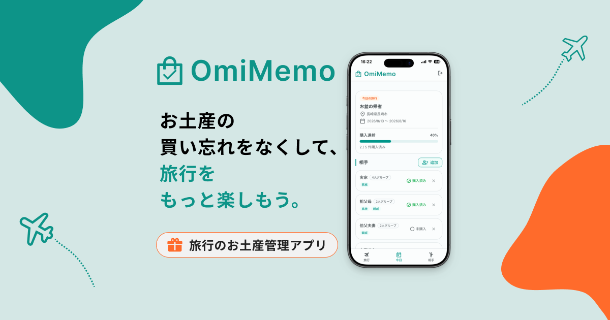
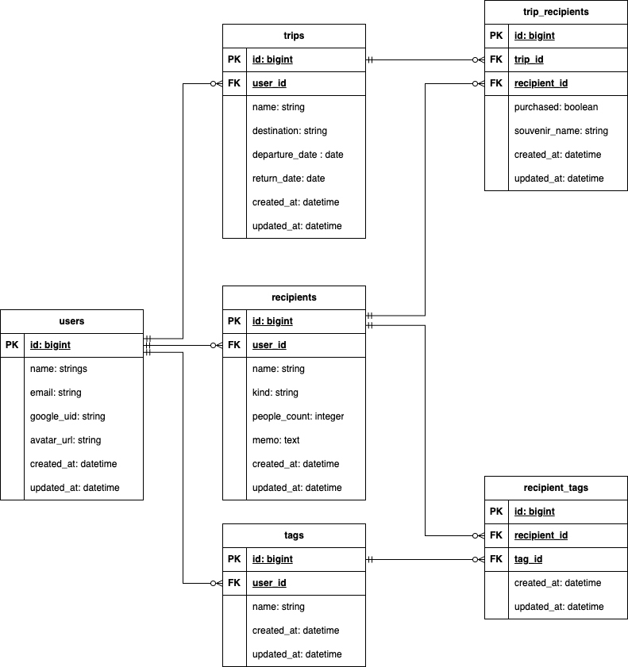

# OmiMemo
サービスURL：https://omimemo.com

## 開発背景

### 開発のきっかけ

私は旅行の際、家族や職場など複数の相手へお土産を購入することがあり、「誰に買ったか」「まだ買っていない人はいないか」を旅行中に何度も確認していました。

旅行中は観光や移動など予定が多いうえ、帰りの交通機関というタイムリミットもあります。そのため、「買い忘れてしまうかもしれない」という不安を抱えながら行動することに負担を感じていました。

この実体験から、お土産の購入状況を簡単に管理し、買い忘れへの不安を減らせないかと考えました。

### 解決したい課題

自分自身の経験を振り返る中で、本当に解決したいのは「お土産を買い忘れること」だけではなく、「買い忘れていないか」を旅行中に何度も気にし続ける心理的な負担だと気づきました。

スマートフォンのメモやチェックリストでも購入状況は記録できますが、旅行ごとに渡す相手を入力したり、購入状況を自分で整理したりする必要があります。

そこで、「旅行」と「お土産を渡す相手」を軸に管理し、一度登録した相手を次回の旅行でも再利用できる仕組みがあれば、旅行前の準備から旅行中の確認までをより負担なく行えると考えました。

### 想定ユーザー

主なユーザーとして、旅行や出張の際に家族・職場・友人など複数の相手へお土産を購入し、「誰に買ったか」を頭の中で確認している人を想定しています。

実際に周囲へお土産の管理方法についてヒアリングしたところ、アプリやメモを使わずに記憶に頼って管理している人が多くいました。

特に、複数の相手へお土産を購入する場面では、「誰に買ったか」「まだ買っていない人はいないか」を記憶だけで管理する負担が生じます。こうした人が、旅行中に購入状況を簡単に確認できるサービスを目指しています。

### OmiMemoで実現したいこと

OmiMemoでは、旅行ごとにお土産を渡す相手を登録し、「誰に買ったか」「まだ買っていない相手は誰か」を一覧で確認できます。

お土産の管理を記憶に依存せず、旅行の最後に「もう買い忘れはない」と確認できることで、買い忘れへの不安を減らし、安心して旅行を楽しめる体験を提供することを目指しています。

## 主な機能

- 「今日の旅行」機能
- お土産購入チェック機能
- タグによる相手の一括追加機能
- お土産品目入力機能
- お土産履歴確認機能

### 「今日の旅行」機能

旅行当日に、お土産を渡す相手の購入状況をすぐに確認できます。

ログイン直後に表示されるように導線を設計し、購入状況を確認するまでの画面遷移を減らしました。

### お土産購入チェック機能

お土産を購入した相手にチェックをつけると「未購入」から「購入済み」に切り替わります。
チェック時には進捗バーも同時に更新されるため、一目で全体の購入状況を確認できます。

### タグによる相手の一括追加機能

お土産を渡す相手をタグで絞り込み、まとめて旅行に追加できます。

### お土産品目入力機能

相手ごとに購入予定・購入したお土産の品目名を記録できます。記録した品目名は、購入後にお土産履歴として残ります。

### お土産履歴確認機能

品目名を入力した購入済みのお土産は、相手詳細画面で履歴として確認できます。過去に何を購入したかを振り返り、次回のお土産選びに活用できます。

## 技術スタック

### 採用技術

| 分類             | 技術                      | 選定理由                                                         |
| --------------- | ------------------------- | ---------------------------------------------------------------- |
| フレームワーク    | Ruby on Rails 8.1.x Ruby 3.4.x | CRUDを中心とした機能を効率よく開発できるため。またPWA対応に必要な構成をRailsの仕組みを活用して導入しやすいため。 |
| フロントエンド    | Hotwire（Turbo + Stimulus） | Railsを中心とした構成のまま動的なUIを実現し、JavaScriptの記述を最小限に抑えるため。
| CSSフレームワーク | Tailwind CSS v4    | 旅行中のスマートフォン利用を想定し、画面サイズに応じたUIを効率よく構築するため。 |
| DB             | Neon（PostgreSQL）           | Railsとの親和性が高いPostgreSQLを利用でき、個人開発の規模では低コストで運用できるため。            |
| 認証            | OmniAuth（omniauth-google-oauth2）   | 旅行中でもログインの手間を減らし、すぐに利用できるようにするため。                        |
| テスト          | RSpec                     | 可読性の高いテストを記述しやすく、モデルやリクエストなどを用途別にテストしてコード品質を担保するため。  |
| 開発環境        | Docker                    | 開発環境の差異をなくし、再現性の高い環境で開発できるようにするため。                                    |
| CI          | GitHub Actions            | テスト、静的解析、そしてセキュリティチェックを自動化し、コード品質を継続的に確認するため。               |
| デプロイ        | Render                    | Railsアプリを低コストで公開でき、GitHub連携による自動デプロイも容易なため。                            |

### 比較検討した技術

| 分類      | 技術  | 理由                                              |
| ------- | ----- | --------------------------------------------------- |
| フロントエンド | React | 複雑なクライアント側の状態管理を必要とせず、Railsを中心とした構成で必要な操作性を実現できると判断したため、ReactではなくHotwireを採用した。 |
| デプロイ | AWS | 個人開発の規模ではインフラ構築・運用の負担が大きいと判断し、Railsアプリを容易にデプロイできるRenderを採用した。  |

## 実装時の工夫

### 相手の作成・編集フォーム

**種別に応じた入力欄の切り替え**

お土産を渡す相手には「個人」と「グループ」の種別があり、グループの場合のみ人数を入力します。
そこでStimulusを利用して、選択した種別に応じて人数入力欄を表示・非表示にしました。
必要な項目だけを表示することで、フォームを分けずに登録できるようにしています。

**タグの作成・付与**

フォーム内で既存のタグの付与だけでなく、新規タグの作成も行えるようにしました。
タグを作成するために別画面へ移動する必要がなく、相手の作成・編集とタグ付けを一度に行えます。

### タグのインライン編集

タグ名の編集のためだけに編集画面に遷移しなくて済むように、Turbo Framesを利用して一覧画面上で編集できるようにしました。

## ER図と設計意図

### ER図

  

MVP後にユーザーからのフィードバックを受け、お土産品目入力機能とお土産履歴機能を追加しました。
それに伴い、trip_recipientsテーブルに`souvenir_name`カラムを追加しています。

以下では設計の変化がわかるように企画・MVP時点のER図も掲載しています。

ER図（企画・MVP時点）

### 設計意図

旅行先でもスマートフォンから少ない操作でお土産を管理できることを意識して設計しました。

#### tripsテーブル

`name`カラムと`destination`カラムをそれぞれ用意しています。
企画当初は`name`のみを用意することを検討しましたが、「新婚旅行」「修学旅行」のように旅行名に目的地を含まないケースを考慮し、旅行名と旅行先を分けて管理する設計としました。

また、`destination`を選択式にすることで旅行先の表記を統一し、将来的に旅行先ごとのお土産データを集計・活用することも検討しました。
しかし、国内・海外を含めた旅行先をどの粒度で管理するかという仕様をまとめきれなかったため、現状は自由入力形式としています。

`departure_date`カラムと`return_date`カラムで旅行期間を管理し、現在の日付が旅行期間内にある旅行を「今日の旅行」として表示できるようにしています。

#### recipientsテーブル

企画当初は、recipientテーブルをusersテーブルとは直接関連付けず、tripsテーブルに紐づける設計を考えていました。
しかし、この設計では旅行を作成するたびに同じ相手を登録し直す必要があります。そこでrecipientsテーブルをusersテーブルに紐付け、tripsテーブルとは中間テーブルを介して多対多で関連付ける設計に変更しました。
これにより、一度登録した相手を次回以降の旅行でも再利用でき、旅行ごとの準備にかかる入力の手間を減らしています。

また`kind`と`people_count`を持たせることで、友人などを「個人」として登録するだけでなく、「職場の人」や「親戚の一家族」などを「グループ」としてまとめて登録できるようにしています。

#### trip_recipientsテーブル

「旅行」と「お土産を渡す相手」を関連付けるための中間テーブルです。

現状のOmiMemoでは、1回の旅行で1人（1グループ）の相手に対して1つのお土産を管理できる仕様としています。
そのため関連付けだけでなく、`purchased`カラムによる購入状況の管理や`souvenir_name`カラムによる品目名の保存など、お土産管理の中心的な役割も持たせています。
将来的に、1回の旅行で1人（1グループ）の相手に対して複数のお土産を管理する仕様に変更する場合は、お土産に関するデータを別テーブルとして切り出すことを検討しています。

#### tagsテーブル、recipient_tagsテーブル

「お土産を渡す相手」をタグで分類するためのテーブルです。
タグで相手を絞り込み、一括で旅行へ追加できるようにすることで、旅行前や旅行中にお土産を渡す相手を一人ずつ追加する手間を減らしています。

## 今後の開発について

今後、以下の機能を実装予定です。

- お土産履歴に画像を保存できる機能
- 旅行の帰宅日に未購入の相手がいる場合、プッシュ通知で知らせる機能

## 補足

画面遷移図（企画・MVP時点）

企画・MVP時点で作成した画面遷移図です。現在の実装とは一部異なる箇所があります。

Figma：[画面遷移図](https://www.figma.com/design/6rH7xvD0kMm6SuhPm2uqBo/%E5%8D%92%E6%A5%AD%E5%88%B6%E4%BD%9C%E7%94%A8%E7%94%BB%E9%9D%A2%E9%81%B7%E7%A7%BB%E5%9B%B3?node-id=0-1&p=f&t=52TY06pkFxwDex0P-0)

